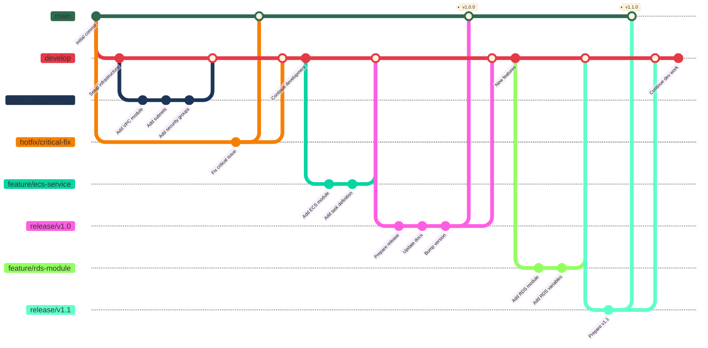

# shelf-shack-infra

Infrastructure-as-code for provisioning Shelf Shack's AWS foundation (networking, ECR, ECS/Fargate, and supporting resources).

## Layout

```
shelf-shack-infra/
├── README.md                    # Main documentation (kept at root)
├── docs/                        # All documentation files
│   ├── DOMAIN_SETUP_GUIDE.md
│   ├── MIGRATION_SUMMARY.md
│   ├── OPENSEARCH_CONTAINER_SETUP.md
│   ├── OPENSEARCH_DISABLED.md
│   ├── OPENSEARCH_IAM_POLICY.md
│   ├── QUICK_FIX_OPENSEARCH.md
│   └── SUBDOMAINS_SUMMARY.md
├── envs/                        # Environment configurations
│   ├── dev/
│   └── prod/
├── modules/                     # Reusable Terraform modules
│   ├── bastion_host/
│   ├── ecr_repository/
│   ├── ecs_service/
│   ├── networking/
│   ├── opensearch/
│   ├── opensearch_container/
│   ├── opensearch_dashboards/
│   ├── opensearch_nlb/
│   └── rds_postgres/
├── policies/                    # IAM policy templates
│   ├── opensearch-iam-policy-terraform.tf
│   └── opensearch-task-role-policy.json
└── scripts/                     # Utility scripts
    └── get_opensearch_endpoint.sh
```

### Directory Descriptions

- `modules/` – Reusable Terraform modules for networking, container registry, and ECS/Fargate service.
- `envs/<env>/` – Environment specific composition of the modules; currently `dev` and `prod` are scaffolded.
- `docs/` – Documentation files including setup guides, migration summaries, and feature documentation.
- `policies/` – IAM policy templates and examples for OpenSearch and other services.
- `scripts/` – Utility scripts for infrastructure management.
- `.github/workflows/` – (to be added once CI for infra is connected) automation entry points.

## Git Branching Strategy

This project follows a Git Flow branching model with the following branches:



### Branch Types

- **`main`** (dark green) - Production-ready code. Only accepts merges from `release` and `hotfix` branches.
- **`develop`** (orange) - Integration branch for features. Always contains the latest development changes.
- **`feature/*`** (light green) - New features and enhancements. Branch from `develop`, merge back to `develop`.
- **`release/*`** (blue) - Release preparation. Branch from `develop`, merge to both `main` and `develop`.
- **`hotfix/*`** (red) - Critical production fixes. Branch from `main`, merge to both `main` and `develop`.

### Workflow

1. **Feature Development**: Create `feature/feature-name` from `develop` → develop → merge back to `develop`
2. **Release**: Create `release/vX.Y` from `develop` → prepare release → merge to `main` (tag) and `develop`
3. **Hotfix**: Create `hotfix/issue-name` from `main` → fix → merge to `main` (tag) and `develop`

## Getting Started
1. `cp envs/dev/backend.tf.example envs/dev/backend.tf` and update the S3 bucket/DynamoDB table used for Terraform state.
2. `cp envs/dev/terraform.tfvars.example envs/dev/terraform.tfvars` and customize values (VPC ranges, container image tag, secrets, etc.).
3. Authenticate to AWS with an IAM role/user that has permissions to create networking, IAM, ECS, ECR, and load balancer resources.
4. From `envs/dev`, run:
   ```bash
   terraform init
   terraform plan -var-file=terraform.tfvars
   terraform apply -var-file=terraform.tfvars
   ```

## Inputs to know about
- `app_environment` – simple map of environment variables injected into the container.
- `app_secrets` – list of SSM parameter or Secrets Manager ARNs wired into the task definition.
- `container_image_tag` – tag pushed by CI/CD (see backend workflow below).
- `enable_load_balancer` – set to `false` on free-tier accounts to skip the ALB; the ECS service will move into public subnets with public IPs automatically and you can flip it back to `true` once ALB limits allow.
- `enable_https`/`certificate_arn` – toggle HTTPS + redirect.
- `route53_zone_id`/`route53_record_name` – optional pair that, when the ALB is enabled, provisions an alias record such as `api.shelfshack.com` that points at the load balancer DNS name.
- `task_role_managed_policies` – attach AWS managed policies needed by the application (S3, SQS, etc.).
- `db_*` variables – manage the PostgreSQL RDS instance (defaults provision `shelfshack` on the free-tier `db.t3.micro` class).
- `enable_ssm_endpoints` – create the VPC interface endpoints required for `aws ecs execute-command` to reach tasks in private subnets.
- `enable_bastion_host` – spin up a tiny Amazon Linux instance with the SSM agent in a private subnet so you can port-forward to RDS (no public exposure). The instance inherits the `AmazonSSMManagedInstanceCore` role.

## Deploying without an ALB
Free-tier AWS accounts often cannot provision an Application Load Balancer. Set `enable_load_balancer = false` in your environment’s `terraform.tfvars` to skip the ALB/NLB resources. When disabled, the ECS service automatically moves into the public subnets, Terraform forces `assign_public_ip = true`, and the service security group exposes the container port directly to the internet so you can hit the task IP for smoke tests.

If you need to force the ECS tasks into a specific subnet set regardless of the mode, provide those IDs via `service_subnet_ids`. Keep your domain (e.g., `shelfshack.com`) in Route 53 but leave `route53_zone_id`/`route53_record_name` unset while the ALB is disabled—there is no static endpoint to alias until the load balancer exists. Later, flip `enable_load_balancer` back to `true`, supply your hosted zone ID plus the desired record name (such as `api.shelfshack.com`), and Terraform will build the ALB + alias record without requiring other code changes.

## Suggested workflow
1. Duplicate `envs/dev` for each environment (e.g. `envs/staging`) and adjust subnet CIDRs/desired counts.
2. Use an AWS IAM role dedicated to Terraform deployments (assumed by CI) and store role ARN in GitHub/GitLab secrets.
3. Promote changes through PRs in this repo: `terraform fmt && terraform validate` locally or in CI (e.g., GitHub Actions + `hashicorp/setup-terraform`).

## CI/CD Integration
- The application repository publishes a Docker image and then runs `terraform apply` here with `TF_VAR_container_image_tag` set to the pushed SHA so ECS receives a new task definition revision.
- Keep environment-specific `terraform.tfvars` files under version control (no secrets) so CI can run unattended. Point secrets (`DATABASE_URL`, `API_KEYS`, etc.) to SSM Parameters or Secrets Manager ARNs referenced in `app_secrets`.
- Grant the CI IAM role permissions for: `ecs:*`, `iam:PassRole` on the task/execution roles, `elasticloadbalancing:*`, `logs:*`, `rds:*` (or specific RDS actions including `rds:ModifyDBSubnetGroup`), `ssm:GetParameters`, `secretsmanager:GetSecretValue`, and CRUD on the state bucket/DynamoDB lock table. See `policies/rds-deploy-role-policy.json` for a complete RDS policy template.
- Provide sensitive DB values (e.g., `db_master_password`) via CI secrets/environment variables such as `TF_VAR_DB_MASTER_PASSWORD`; the configuration accepts either casing.
- When `enable_bastion_host=true`, use AWS Systems Manager port forwarding to reach RDS from your laptop:
  ```bash
  aws ssm start-session \
    --target $(terraform output -raw bastion_instance_id) \
    --document-name AWS-StartPortForwardingSession \
    --parameters '{"portNumber":["5432"],"localPortNumber":["15432"]}'
  ```
  Then point DBeaver at `localhost:15432`.


Next Steps

Copy rentify-infra/envs/dev/backend.tf.example and terraform.tfvars.example, fill in real state bucket/DynamoDB/table names plus image/env values, then run terraform fmt -recursive, terraform init, and terraform apply -var-file=terraform.tfvars.
Create the GitHub secrets (AWS_REGION, AWS_DEPLOY_ROLE_ARN, ECR_REPOSITORY, INFRA_REPOSITORY, INFRA_REPO_TOKEN), ensure the deploy role trusts GitHub’s OIDC provider, and trigger .github/workflows/deploy.yml via a manual dispatch to verify the end-to-end deployment.
Replicate envs/dev for staging/prod as needed and consider adding autoscaling policies or per-environment overrides in Terraform once the initial Fargate stack is confirmed.


Infra Automation Plan

Use a separate rentify-infra repo to hold Terraform or CDK stacks so app and infra release cycles stay decoupled. Keep backend repo focused on code/tests while infra repo owns ECS/Fargate stacks, IAM, networking, etc.
Step 1: Define baseline AWS networking (VPC, subnets, security groups) via IaC (rentify-infra). Include ECS Cluster, IAM roles (task execution, task role, deployment role), Log groups, ECR repos, and shared parameters (Secrets Manager/SSM).
Step 2: Model ECS task definition, Fargate service, autoscaling policies, and ALB/NLB listeners + target groups in the infra repo. Use Terraform modules or CDK constructs to keep definitions versioned and reproducible.
Step 3: In the app repo, add CI (GitHub Actions/GitLab/etc.) with these stages:
Build & test.
Build Docker image, tag with commit SHA, push to ECR.
Trigger infra deploy (either call Terraform Cloud/Atlantis pipeline in rentify-infra, or run Terraform plan/apply with workspace credentials). Pass new image tag via SSM parameter or Terraform variable to update task definition.
Run aws ecs update-service --force-new-deployment once Terraform updates the task definition revision.
Step 4: Automate MR→main integration:
Require successful CI + security scans before merge.
On merge to main, pipeline runs deploy job automatically. Use GitHub Actions environments or GitLab protected variables to store AWS creds.
Optionally, promote via environments (dev → staging → prod) with manual approvals; each environment uses same templates with different variables.
Step 5: For one-click cluster creation, add bootstrap target in infra repo (e.g., terraform apply -var-file env/dev.tfvars) which provisions cluster, task definition, and service. Document tagging & IaC state management (S3 + DynamoDB lock).
Step 6: Secure automation:
Use OIDC/GitHub Actions or GitLab’s federated roles to avoid long-lived AWS keys.
IAM roles: GitHubActionsDeployRole (assume from CI), ECS task execution role, task app role, ALB access role.
Step 7: Observability & rollbacks:
CloudWatch logs/metrics, ECS service alarms, deployment circuit breakers.
Store previous task definition/AMI versions for quick rollback.
Step 8: Governance:
Protect rentify-infra main branch; require review on Terraform changes.
Optionally, integrate Atlantis/Terraform Cloud for PR plans & applies.


--------------------------
Backend Repo (rentify-backend)

README.md (line 8) documents the GitHub Actions workflow requirements; populate these secrets/vars in the repo settings → Secrets and variables → Actions:
AWS_REGION: e.g. us-east-1.
AWS_DEPLOY_ROLE_ARN: IAM role GitHub can assume via OIDC.
ECR_REPOSITORY: full repo URI (123456789012.dkr.ecr.us-east-1.amazonaws.com/rentify-dev).
INFRA_REPOSITORY: owner/rentify-infra.
INFRA_REPO_TOKEN: classic PAT or fine-grained token with read rights on the infra repo.
If you keep a .env for local runs, update it with the same SSM/Secrets Manager ARNs you’ll wire in Terraform so local FastAPI points at the same resources (DB URL, Redis endpoints, etc.).
Infra Repo (rentify-infra)

State backend

envs/dev/backend.tf.example (line 1): copy to backend.tf and set an S3 bucket + DynamoDB table you create in AWS (e.g., bucket rentify-terraform-state, table rentify-terraform-locks with LockID primary key). Terraform needs permissions to read/write both.
Environment variables

envs/dev/terraform.tfvars.example (line 1): copy to terraform.tfvars and fill in:
aws_region, project, environment.
availability_zones, subnet CIDRs that match your VPC plan.
container_image_tag default (workflow overrides at deploy time).
app_environment values (non-secret config).
app_secrets: list of ARNs from Secrets Manager or SSM Parameter Store—for each, create the secret/parameter in AWS first and paste the ARN.
Terraform inputs

envs/dev/variables.tf (line 1) shows every input; adjust defaults if dev/stage/prod differ (CPU/memory, listener ports, HTTPS settings, etc.).
If you plan to serve HTTPS, request/validate an ACM certificate and set enable_https=true + certificate_arn=<your cert> either in terraform.tfvars or via environment-specific override.
IAM + roles

Create IAM role for GitHub Actions (e.g., RentifyDeployRole). Trust policy must allow your GitHub organisation's OIDC provider (token.actions.githubusercontent.com) with conditions on repo/branch. Attach permissions:
ECR push/pull (ecr:* on repo).
ECS + Application Load Balancer + CloudWatch Logs creation/updates.
RDS permissions for managing PostgreSQL instances and DB subnet groups (see `policies/rds-deploy-role-policy.json`).
IAM permissions for creating roles, instance profiles, and policies (see `policies/deploy-role-iam-ec2-policy.json`).
EC2 permissions for launching and managing EC2 instances (see `policies/deploy-role-iam-ec2-policy.json`).
iam:PassRole for the ECS task + execution roles Terraform creates.
S3/DynamoDB access for Terraform state.
ssm:GetParameters / secretsmanager:GetSecretValue for referenced secrets.
See `docs/DEPLOY_ROLE_IAM_SETUP.md` for complete setup instructions.
Create IAM roles for the ECS task/execution if you’d rather not let Terraform manage them; otherwise Terraform creates them automatically.
ECR repo

Either let Terraform create one via the ecr_repository module or pre-create and import (repo name = project-environment-repo). Record its URI for ECR_REPOSITORY.
Networking

No manual changes necessary if Terraform owns VPC/subnets. If you already have a VPC, either import those resources or set the module to accept existing IDs (requires tweaking module). Current defaults create a new VPC; ensure CIDRs don’t overlap existing ones.
Secrets & Parameters

For every entry in app_secrets, create an AWS Secrets Manager secret or SSM parameter. Use arn:aws:ssm:REGION:ACCOUNT:parameter/... or arn:aws:secretsmanager:... in terraform.tfvars.
Non-secret env vars go in app_environment. Use consistent names with your FastAPI config.
ACM / Route 53 (optional)

If you want HTTPS + custom domain, request an ACM certificate in the ALB region, validate it, and supply certificate_arn. Later you can create Route 53 alias records pointing to the ALB DNS (terraform output load_balancer_dns).
AWS Setup Checklist

Create S3 bucket (aws s3api create-bucket) and DynamoDB table for Terraform state/locks.
Create IAM OIDC provider for GitHub (if not already) and the AWS_DEPLOY_ROLE_ARN with appropriate policies.
Provision AWS Secrets Manager / SSM parameters referenced in app_secrets.
(Optional) Pre-create RDS/ElastiCache/etc. referenced by your backend; store connection info in secrets/params.
(Optional) Request ACM certificates for any domains and note the ARN.
Confirm ECR repo exists or let Terraform create it; ensure lifecycle policies match retention goals.
Once these values are in place:

Commit backend.tf + terraform.tfvars (no creds inside).
Run terraform init/plan/apply locally once to bootstrap.
Add GitHub secrets/vars.
Push to main; workflow builds/pushes image, Terraform applies changes with the correct image tag, ECS service rolls new tasks, and ALB DNS (from workflow summary) serves the latest backend build.
