# AWS Architecture Diagram - ShelfShack Infrastructure

## 🏗️ Visual Architecture

```mermaid
graph TB
    subgraph Internet["Internet"]
        Users["Users"]
        GitHub["GitHub Actions CI/CD"]
    end

    subgraph AWS["AWS Cloud us-east-1"]
        subgraph VPC["VPC shelfshack-dev-vpc 10.0.0.0/16"]
            subgraph PublicSubnets["Public Subnets 10.0.0.0/24, 10.0.1.0/24"]
                IGW["Internet Gateway shelfshack-dev-igw"]
                NAT["NAT Gateway shelfshack-dev-nat"]
                ALB["Application Load Balancer shelfshack-dev-alb Optional disabled"]
            end

            subgraph PrivateSubnets["Private Subnets 10.0.10.0/24, 10.0.11.0/24"]
                subgraph ECS["ECS Fargate"]
                    ECSCluster["ECS Cluster shelfshack-dev-cluster"]
                    ECSService["ECS Service shelfshack-dev-service Port 8000"]
                    ECSTasks["Fargate Tasks CPU 1024, Memory 2048MB"]
                end

                RDS["RDS PostgreSQL shelfshack-dev-postgres Port 5432"]

                OpenSearchEC2["OpenSearch EC2 m7i-flex.large Port 9200, 9600"]

                Bastion["Bastion Host Disabled"]
            end

            subgraph VPCEndpoints["VPC Endpoints"]
                SSMEndpoint["SSM Endpoint"]
                SSMMessagesEndpoint["SSM Messages Endpoint"]
                EC2MessagesEndpoint["EC2 Messages Endpoint"]
            end
        end

        subgraph API["API Gateway"]
            HTTPAPI["HTTP API Gateway shelfshack-dev-backend Stage development"]
            WebSocketAPI["WebSocket API Gateway shelfshack-dev-websocket Stage development"]
        end

        subgraph Lambda["Lambda Functions"]
            WebSocketLambda["WebSocket Proxy shelfshack-dev-websocket-proxy"]
        end

        subgraph Storage["Storage"]
            ECR["ECR Repository shelfshack-dev-repo"]
            S3["S3 Bucket shelfshack-dev-uploads Manual"]
            S3State["S3 State Bucket shelfshack-terraform-state Manual"]
        end

        subgraph Database["Databases"]
            DynamoDB["DynamoDB shelfshack-dev-websocket-connections"]
            DynamoDBLocks["DynamoDB Locks shelfshack-terraform-locks Manual"]
        end

        subgraph IAM["IAM"]
            DeployRole["Deploy Role shelfshackDeployRole"]
            ExecutionRole["Execution Role shelfshack-dev-execution-role"]
            TaskRole["Task Role shelfshack-dev-task-role"]
        end

        subgraph Secrets["Secrets Manager"]
            SecretsManager["Secrets shelfshack"]
        end

        subgraph Monitoring["CloudWatch"]
            LogGroups["Log Groups ecs shelfshack-dev aws ecs executioncommand"]
        end

        subgraph DNS["Route53"]
            Route53["Route53 Records Optional"]
        end
    end

    Users -->|HTTPS HTTP| HTTPAPI
    Users -->|WSS| WebSocketAPI
    GitHub -->|Assume Role| DeployRole
    HTTPAPI -->|Proxy| ECSService
    WebSocketAPI -->|Invoke| WebSocketLambda
    WebSocketLambda -->|Connect| ECSService
    ECSService -->|Query| RDS
    ECSService -->|Search| OpenSearchEC2
    ECSService -->|Upload Download| S3
    ECSService -->|Read Secrets| SecretsManager
    ALB -.->|Optional| ECSService
    ECSService -->|Via NAT| IGW
    ECSService -->|Via VPC Endpoints| SSMEndpoint
    DeployRole -->|Deploy| ECR
    DeployRole -->|Manage| ECSCluster
    DeployRole -->|Manage| RDS
    ExecutionRole -->|Pull Images| ECR
    ExecutionRole -->|Read Secrets| SecretsManager
    TaskRole -->|Access| S3
    TaskRole -->|Read Secrets| SecretsManager
    WebSocketLambda -->|Store Connections| DynamoDB
    WebSocketLambda -->|Proxy to| ECSService

    classDef vpc fill:#4A90E2,stroke:#2E5C8A,stroke-width:3px,color:#fff
    classDef compute fill:#FF6B6B,stroke:#C92A2A,stroke-width:2px,color:#fff
    classDef storage fill:#51CF66,stroke:#2F9E44,stroke-width:2px,color:#fff
    classDef network fill:#FFD43B,stroke:#F59F00,stroke-width:2px,color:#000
    classDef database fill:#845EF7,stroke:#5F3DC4,stroke-width:2px,color:#fff
    classDef security fill:#FF8787,stroke:#C92A2A,stroke-width:2px,color:#fff
    classDef api fill:#339AF0,stroke:#1971C2,stroke-width:2px,color:#fff

    class VPC,PublicSubnets,PrivateSubnets vpc
    class ECSCluster,ECSService,ECSTasks,OpenSearchEC2,Bastion compute
    class ECR,S3,S3State storage
    class IGW,NAT,ALB,HTTPAPI,WebSocketAPI,Route53 network
    class RDS,DynamoDB,DynamoDBLocks database
    class DeployRole,ExecutionRole,TaskRole,SecretsManager security
    class HTTPAPI,WebSocketAPI api
```

## 📊 Resource Inventory

### 🏗️ Networking (VPC Module)
- ✅ **VPC**: `shelfshack-dev-vpc` (10.0.0.0/16)
- ✅ **Internet Gateway**: `shelfshack-dev-igw`
- ✅ **NAT Gateway**: `shelfshack-dev-nat` (with Elastic IP)
- ✅ **Public Subnets**: 2 subnets (10.0.0.0/24, 10.0.1.0/24)
- ✅ **Private Subnets**: 2 subnets (10.0.10.0/24, 10.0.11.0/24)
- ✅ **Route Tables**: Public & Private
- ✅ **VPC Endpoints**: SSM, SSM Messages, EC2 Messages (for ECS Exec)

### 🚀 Compute (ECS Module)
- ✅ **ECS Cluster**: `shelfshack-dev-cluster`
- ✅ **ECS Service**: `shelfshack-dev-service`
- ✅ **Task Definition**: `shelfshack-dev-task`
- ✅ **Fargate Tasks**: CPU 1024, Memory 2048MB
- ✅ **Application Load Balancer**: `shelfshack-dev-alb` (optional, currently disabled)
- ✅ **Target Group**: `shelfshack-dev-tg`
- ✅ **Security Groups**: ALB SG, Service SG

### 🗄️ Database (RDS Module)
- ✅ **RDS PostgreSQL**: `shelfshack-dev-postgres`
- ✅ **Engine**: PostgreSQL 17.6
- ✅ **Storage**: 20GB
- ✅ **Security Group**: RDS SG

### 🔍 Search (OpenSearch EC2 Module)
- ✅ **EC2 Instance**: `m7i-flex.large` (8GB RAM, 2 vCPU)
- ✅ **OpenSearch**: Version 2.11.0
- ✅ **Ports**: 9200 (HTTP), 9600 (Performance Analyzer)
- ✅ **Security Group**: OpenSearch EC2 SG

### 🌐 API Gateway
- ✅ **HTTP API Gateway**: `shelfshack-dev-backend`
  - Route: `ANY /{proxy+}` → ECS Service
  - Route: `ANY /` → ECS Service
  - Stage: `development`
- ✅ **WebSocket API Gateway**: `shelfshack-dev-websocket`
  - Routes: `$connect`, `$disconnect`, `$default`
  - Stage: `development`

### ⚡ Lambda
- ✅ **WebSocket Proxy**: `shelfshack-dev-websocket-proxy`
  - Connects WebSocket API → ECS Service
  - Stores connections in DynamoDB

### 💾 Storage
- ✅ **ECR Repository**: `shelfshack-dev-repo`
- ✅ **S3 Bucket**: `shelfshack-dev-uploads` (manual)
- ✅ **S3 State Bucket**: `shelfshack-terraform-state` (manual)

### 📊 Databases
- ✅ **DynamoDB Table**: `shelfshack-dev-websocket-connections`
- ✅ **DynamoDB Locks**: `shelfshack-terraform-locks` (manual)

### 🔐 IAM Roles
- ✅ **Deploy Role**: `shelfshackDeployRole`
  - Consolidated inline policy
  - 5 managed policies attached
- ✅ **Execution Role**: `shelfshack-dev-execution-role`
  - Secrets Manager access
- ✅ **Task Role**: `shelfshack-dev-task-role`
  - S3 access (shelfshack-dev-uploads)
  - Secrets Manager access

### 📝 Monitoring
- ✅ **CloudWatch Log Groups**:
  - `/ecs/shelfshack-dev`
  - `/aws/ecs/executioncommand/shelfshack-dev-cluster`
  - `/aws/lambda/shelfshack-dev-websocket-proxy`

### 🌐 DNS (Optional)
- ✅ **Route53 Records**: API subdomain (if configured)

---

## 🎨 Color Legend

- 🔷 **Blue**: Networking & VPC
- 🔴 **Red**: Compute (ECS, EC2)
- 🟢 **Green**: Storage (S3, ECR)
- 🟡 **Yellow**: Network Services (ALB, API Gateway)
- 🟣 **Purple**: Databases (RDS, DynamoDB)
- 🟠 **Orange**: Security (IAM, Secrets)
- 🔵 **Light Blue**: API Services

---

## 📐 Architecture Flow

1. **User Request** → HTTP API Gateway → ECS Service (Port 8000)
2. **WebSocket** → WebSocket API Gateway → Lambda → ECS Service
3. **ECS Service** → RDS (Port 5432) for database queries
4. **ECS Service** → OpenSearch EC2 (Port 9200) for search
5. **ECS Service** → S3 for file uploads/downloads
6. **ECS Service** → Secrets Manager for configuration
7. **CI/CD** → Deploy Role → ECR, ECS, RDS management

---

## 🔗 Key Connections

| From | To | Protocol/Port | Purpose |
|------|-----|---------------|---------|
| HTTP API Gateway | ECS Service | HTTP/8000 | REST API Proxy |
| WebSocket API | Lambda | WebSocket | WebSocket Proxy |
| Lambda | ECS Service | HTTP/8000 | Backend Connection |
| ECS Service | RDS | TCP/5432 | Database Queries |
| ECS Service | OpenSearch EC2 | HTTP/9200 | Search Queries |
| ECS Service | S3 | HTTPS/443 | File Storage |
| ECS Service | Secrets Manager | HTTPS/443 | Configuration |
| ECS Tasks | Internet | Via NAT Gateway | External API Calls |
| ECS Tasks | SSM | Via VPC Endpoints | ECS Exec |

---

## 📍 Resource Locations

- **Region**: `us-east-1`
- **Availability Zones**: `us-east-1a`, `us-east-1b`
- **VPC CIDR**: `10.0.0.0/16`
- **Public Subnets**: `10.0.0.0/24`, `10.0.1.0/24`
- **Private Subnets**: `10.0.10.0/24`, `10.0.11.0/24`

